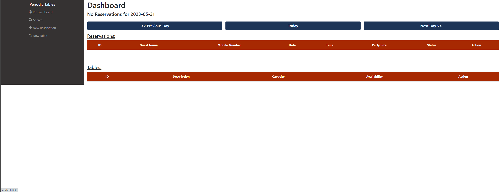
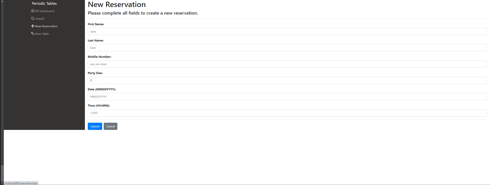
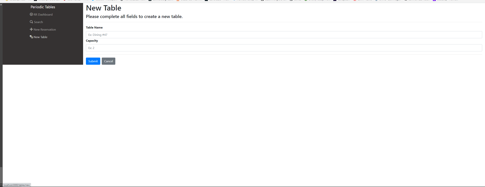
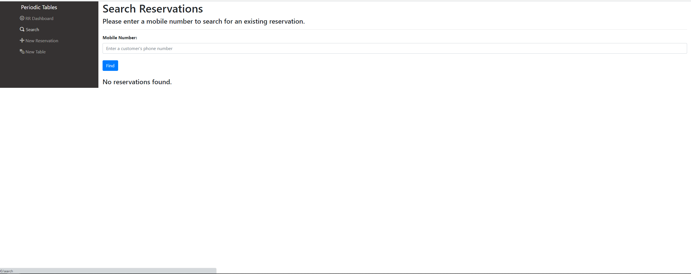

# Restaurant Reservation Project: Thinkful Capstone
You have been hired as a full stack developer at Periodic Tables, a startup that is creating a reservation system for fine dining restaurants.
The software is used only by restaurant personnel when a customer calls to request a reservation. This application allows a user to create, edit, and cancel a reservation. Create a table, seat a reservation to a table, and finish a table. 
As well as search for reservations by phone number.
# Technology & Tools
- Node.JS
- React
- React Hooks
- Express
- Knex
- PostgreSQL
- Bootstrap
- HTML5
- CSS
- Git
# Screenshots
## Dash Board

## New Reservation

## New Table 

## Search

# Takeaways
- Version control with Git is essential for maintaining organization and implementing features independently.
-  Additionally, utilizing a Kanban board can greatly contribute to the success of developing a full-stack application. 
-  In terms of coding, it is best to prioritize writing functional code initially and then focus on streamlining and optimizing as needed, avoiding unnecessary complexity from the start.
